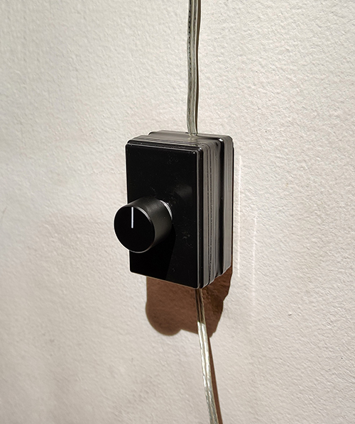
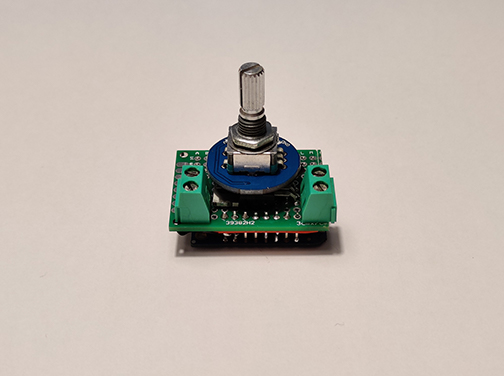
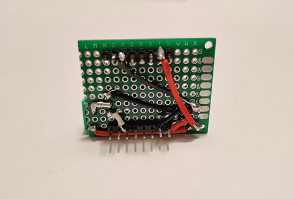

# HADIS - Dimmer

MQTT controller for ikea LED lamp.
Start setup mode by pressing encoder button for approximately 6sec.

## Electronics
* Microcontroller: [LOLIN D1 mini](https://www.wemos.cc/en/latest/d1/d1_mini.html)
* Mosfet: [IRLZ44NPbF](http://www.infineon.com/dgdl/irlz44npbf.pdf?fileId=5546d462533600a40153567217c32725)
* Rotary Encoder
* 10k ohm resistor

Full schematic available [here](./assets/DimmerSchematic.pdf).

## Pins
* Mosfet: GPIO 5
* Encoder S1: GPIO 12
* Encoder S2: GPIO 14
* Encoder button: GPIO 13

## MQTT topic
* HADIS/*deviceName*/LIGHT -> handle brightness level
* HADIS/*deviceName*/LIGHT-TOGGLE -> handle set brightness on toggle
* HADIS/*deviceName*/DOUBLE-CLICK -> ping topic for responding on double click
* HADIS/*deviceName*/SETUP -> handle setup mode activation
* HADIS/*deviceName*/STATUS -> handle device status (ONLINE/OFFLINE)
*deviceName* is a placeholder for specific topics

## Pictures

Finished controller

Side of the controller's insides

Controller's wiring on the back side

Controller with D1 mini attached
