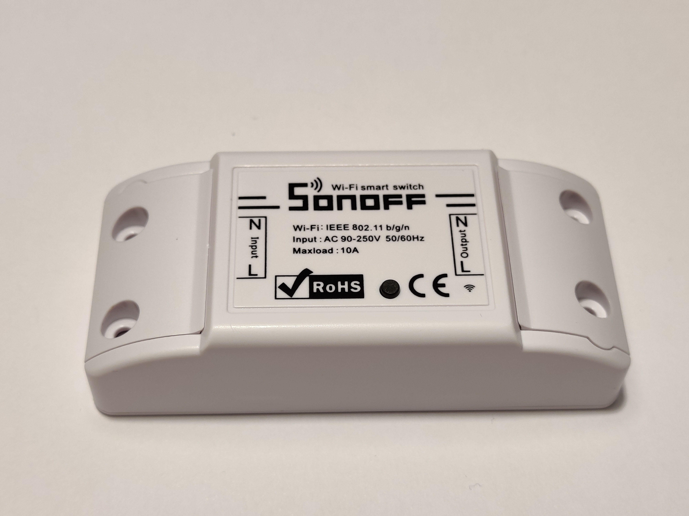
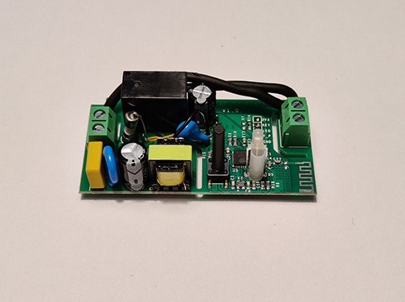

# HADIS - Solo

MQTT relay switch.
Start setup mode by pressing the button for approximately 6sec.

## Electronics
* Device: [Sonoff Basic R2](https://sonoff.tech/product/wifi-diy-smart-switches/basicr2)

## Pins
* Button: GPIO 0
* Relay: GPIO 12
* Indicator LED: GPIO 13

## Pictures

Switch with case

Switch without case
