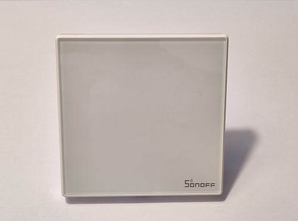
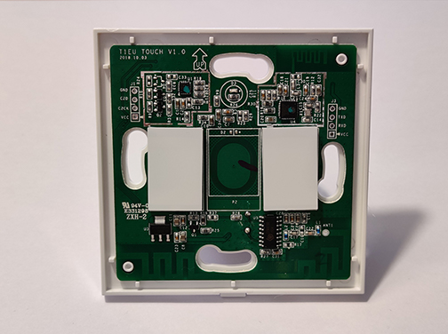
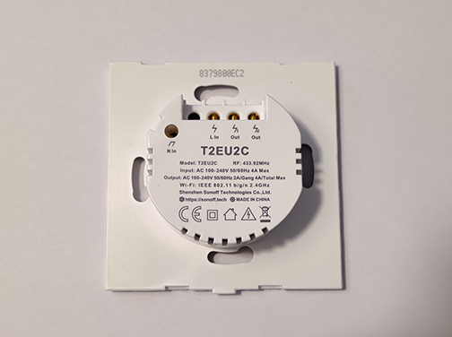

# HADIS - Touch

MQTT relay wall touch switch for light control.
Start setup mode by pressing the touch button for approximately 6sec.

## Electronics
* Device: [Sonoff Touch TXT3](https://www.itead.cc/smart-home/sonoff-tx-series-wifi-smart-wall-switches.html)

## Pins
* Button: GPIO 0
* Relay: GPIO 12
* Indicator LED: GPIO 13

## Pictures

Switch with cover plate

Switch without cover plate

Switch from the back
