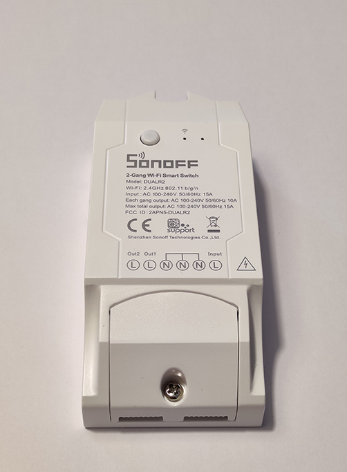

# HADIS - Solo

MQTT dual relay switch for installing in existing switch box.
Start setup mode by pressing the connected switch 1 for approximately 6sec. Connection schematic available [here](./assets/DuoSchematic.pdf).

## Electronics
* Device: [Sonoff Basic R2](https://sonoff.tech/product/wifi-diy-smart-switches/basicr2)

## Pins
* Switch connection 1: GPIO 0
* Relay 1: GPIO 12
* Switch connection 2: GPIO 9
* Relay 2: GPIO 5
* Indicator LED: GPIO 13

## MQTT topics
* HADIS/*deviceName*/SWITCH1 -> handle relay1 state
* HADIS/*deviceName*/SWITCH2 -> handle relay2 state
* HADIS/*deviceName*/LONG2 -> send message when long press button2
* HADIS/*deviceName*/SETUP -> handle setup mode activation
* HADIS/*deviceName*/STATUS -> handle device status (ONLINE/OFFLINE)

*deviceName* is a placeholder for specific topics

## Pictures

Switch with case

Switch without case
