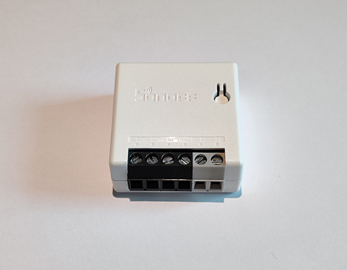
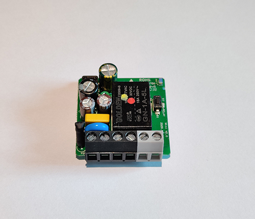

# HADIS - Mini

MQTT relay switch for installing in existing switch box.
Start setup mode by pressing the connected switch for approximately 6sec. Connection schematic available [here](./assets/MiniSchematic.pdf).

## Electronics
* Device: [Sonoff Mini R2](https://sonoff.tech/product/wifi-diy-smart-switches/sonoff-minir2)

## Pins
* Switch connection: GPIO 4
* Relay: GPIO 12
* Indicator LED: GPIO 13

## MQTT topics
* HADIS/*deviceName*/SWITCH -> handle relay state
* HADIS/*deviceName*/SETUP -> handle setup mode activation
* HADIS/*deviceName*/STATUS -> handle device status (ONLINE/OFFLINE)

*deviceName* is a placeholder for specific topics

## Pictures

Switch with case

Switch without case
