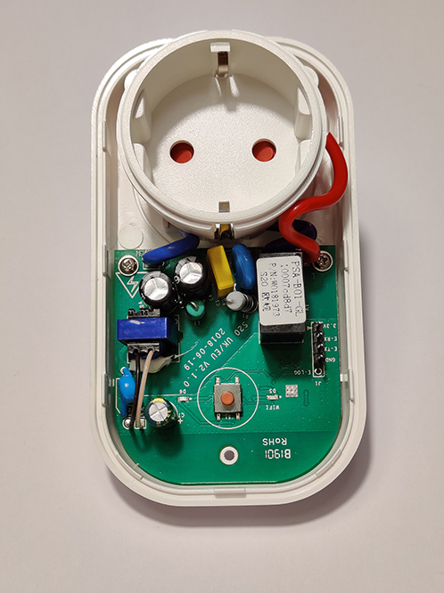

# HADIS - Plug

MQTT relay switch wall plug version.
Start setup mode by pressing the button for approximately 6sec.

## Electronics
* Device: [Sonoff S20](https://sonoff.tech/product/wifi-smart-plugs/s20)

## Pins
* Button: GPIO 0
* Relay: GPIO 12
* Green LED: GPIO 13

## MQTT topics
* HADIS/*deviceName*/SWITCH -> handle relay state
* HADIS/*deviceName*/SETUP -> handle setup mode activation
* HADIS/*deviceName*/STATUS -> handle device status (ONLINE/OFFLINE)

*deviceName* is a placeholder for specific topics

## Pictures

Wall plug with case

Wall plug opened
