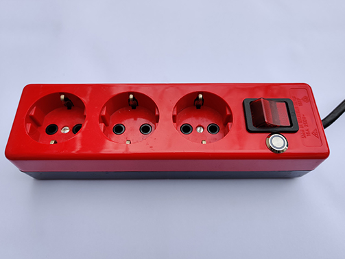
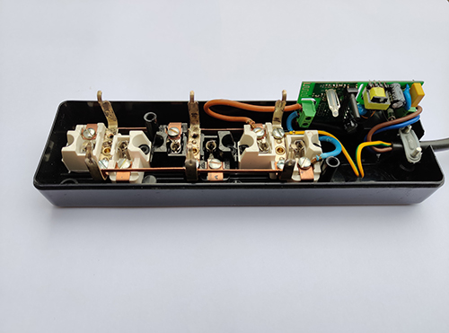

# HADIS - Solo

MQTT relay power strip.
Start setup mode by pressing the button for approximately 6sec.

## Electronics
* Device: [Sonoff Basic R2](https://sonoff.tech/product/wifi-diy-smart-switches/basicr2)

Full schematic available [here](./assets/StripSchematic.pdf).

## Pins
* Power LED: GPIO 1
* Button: GPIO 3
* Relay: GPIO 12
* Indicator LED: GPIO 13

## MQTT topics
* HADIS/*deviceName*/SWITCH -> handle relay state
* HADIS/*deviceName*/SETUP -> handle setup mode activation
* HADIS/*deviceName*/STATUS -> handle device status (ONLINE/OFFLINE)

*deviceName* is a placeholder for specific topics

## Pictures

Power strip with case

Power strip without case
