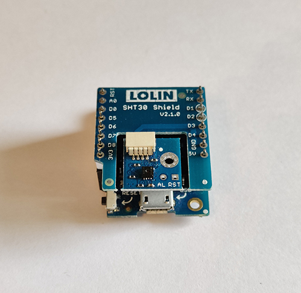

# HADIS - THS

MQTT Temperature & relative humidity sensor.
Measurements are reported every 60 seconds.
Setup mode starts automatically after 1 minute without connection to MQTT broker. During this time blue LED is turned on the controller.

## Electronics
* Microcontroller: [LOLIN D1 mini](https://www.wemos.cc/en/latest/d1/d1_mini.html)
* Sensor: [SHT30 Shield](https://www.wemos.cc/en/latest/d1_mini_shield/sht30.html)

Full schematic available [here](./assets/THS-Schematic.pdf).

## Pins
* SDA: GPIO 4
* SCL: GPIO 5

## MQTT topics
* HADIS/*deviceName*/TEMP -> send temperature value
* HADIS/*deviceName*/HUM -> send relative humidity value
* HADIS/*deviceName*/SETUP -> handle setup mode activation
* HADIS/*deviceName*/STATUS -> handle device status (ONLINE/OFFLINE)

*deviceName* is a placeholder for specific topics

## Pictures

Sensor without case
